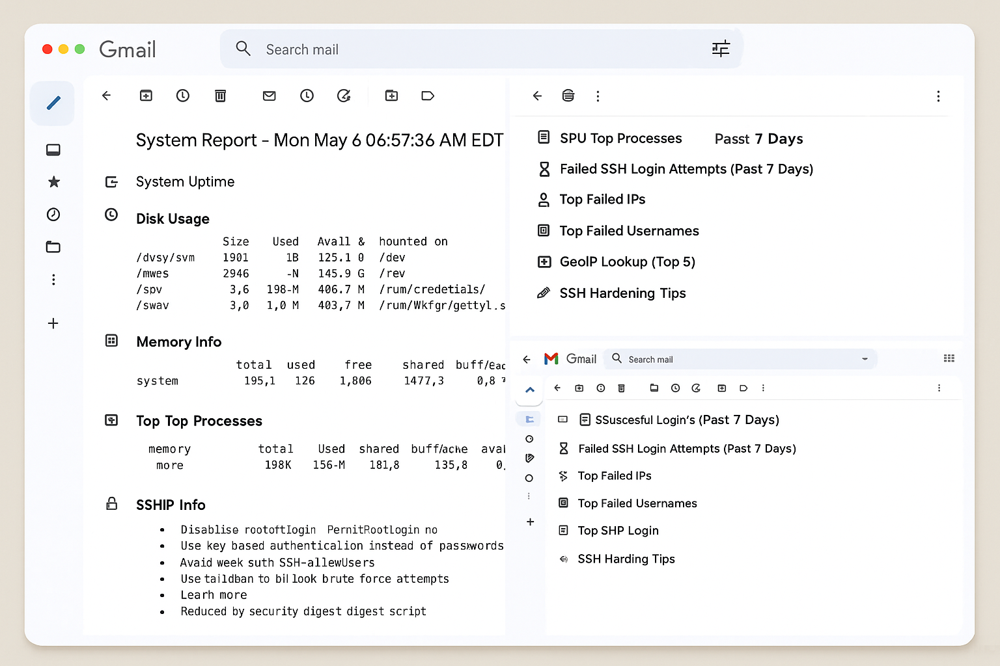

# Weekly SSH & System Report Script

This project is a comprehensive Bash script that generates a detailed weekly summary of SSH login activity and system performance metrics. The script can export the report to a file and email it in HTML format using Gmail SMTP and `msmtp`.

---

## 🚀 Features

* ✅ SSH login summary (successful and failed attempts)
* ✅ Repeated failed attempts by IP or username
* ✅ Timestamps of first and last login attempt
* ✅ GeoIP lookup of IP addresses
* ✅ Disk usage (`df -h`)
* ✅ CPU & RAM stats (`top`, `free -h`)
* ✅ System uptime (`uptime`)
* ✅ Hardening tips for SSH
* ✅ Weekly email digest with HTML formatting
* ✅ Scheduled via `cron` or `systemd`

---

## 📸 Screenshots

Here’s a preview of the HTML report emailed weekly:




## 📂 Project Structure

```
ssh-weekly-report/
├── weekly_system_report.sh   # Main script
├── config.env                # Optional configuration file
├── .gitignore                # Git ignore rules
└── README.md                 # Documentation
```

---

## ⚙️ Setup Instructions

### 1. Clone the Repository

```bash
git clone https://github.com/Elite-Techs/Weekly-SSH-System-Report-Script

cd ssh-weekly-report
```

### 2. Install Dependencies

```bash
sudo apt update && sudo apt install geoip-bin jq msmtp msmtp-mta mailutils -y
```

### 3. Configure Gmail with msmtp

Follow these steps:

* Go to [https://myaccount.google.com/apppasswords](https://myaccount.google.com/apppasswords)
* Generate an "App Password" for "Mail"
* Configure `~/.msmtprc` with your credentials:

```
defaults
auth on
tls on
tls_trust_file /etc/ssl/certs/ca-certificates.crt
logfile ~/.msmtp.log

account gmail
host smtp.gmail.com
port 587
from your-email@gmail.com
user your-email@gmail.com
password YOUR_APP_PASSWORD

account default : gmail
```

Make sure it's readable only by you:

```bash
chmod 600 ~/.msmtprc
```

### 4. Configure the Script

You can either:

* Edit the email directly in the script
* Or use a `.env` file like this:

```bash
EMAIL_TO="your-email@gmail.com"
GEOIP_DB="/usr/share/GeoIP/GeoLite2-City.mmdb"
```

Load it in the script using:

```bash
source ./config.env
```

---

## 📬 Running the Script

### Manual Run

```bash
./weekly_system_report.sh
```

### Automated via `cron`

```bash
crontab -e
```

Add:

```cron
0 8 * * 1 /path/to/weekly_system_report.sh
```

### Or use `systemd` (advanced)

Add systemd service and timer units to run weekly.

---

## 📜 License

MIT License. See `LICENSE` file for details.
